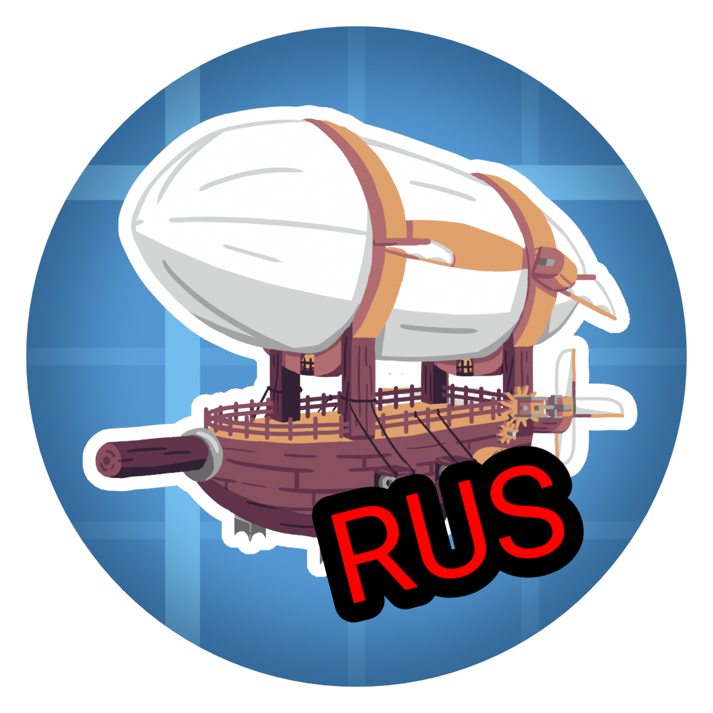

# [Create Aeronautics] Russian Translation

  

Этот репозиторий содержит исходный код ресурс-пака с полным переводом на русский язык для набора модов **Create Aeronautics** (включая модули *Simulated* и *Offroad*).

## Что переведено?

Перевод выполнен максимально качественно с оглядкой на терминологию оригинального мода **Create**.

* **Все предметы и блоки:** Полная русификация всех трёх составляющих бандла: Aeronautics, Simulated и Offroad.
* **Расширенные подсказки (на Shift):** Описания механик и характеристик предметов, которые появляются при зажатии клавиши Shift.
* **Обучение:** Весь текст во внутриигровых 3D-сценах обучения (зажимается на `W`) полностью переведен.
* **Интерфейсы:** Меню навигационных столов, печатных машинок и системные сообщения физического движка.

## ⚠️ Отказ от ответственности (Disclaimer)

**Я никак не связан с командой разработчиков Simulated Team и их модом Create Aeronautics!** Я просто энтузиаст, который сделал перевод для всего русскоязычного комьюнити. Весь контент мода принадлежит его создателям. Моя цель — сделать проект доступнее, не нарушая прав авторов и не претендуя на их прибыль.

Если вы являетесь автором мода и у вас есть вопросы к этому переводу — пожалуйста, напишите мне в Issues или личные сообщения.

## 🛠 Установка

1. Перейдите в раздел **Releases** и скачайте последнюю версию `.zip` архива.
2. Поместите архив в папку `.minecraft/resourcepacks`.
3. В игре активируйте пак в настройках.
4. **Важно:** Убедитесь, что пак находится выше ресурсов самого мода в списке!

## Лицензия

Этот проект распространяется под лицензией **MIT License**. Вы можете свободно использовать, изменять и распространять этот перевод, при условии указания авторства (**mishtok**).

---
**Автор:** mishtok
**Версия игры:** 1.21.1
